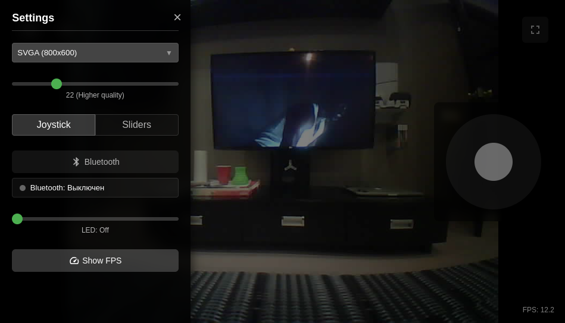
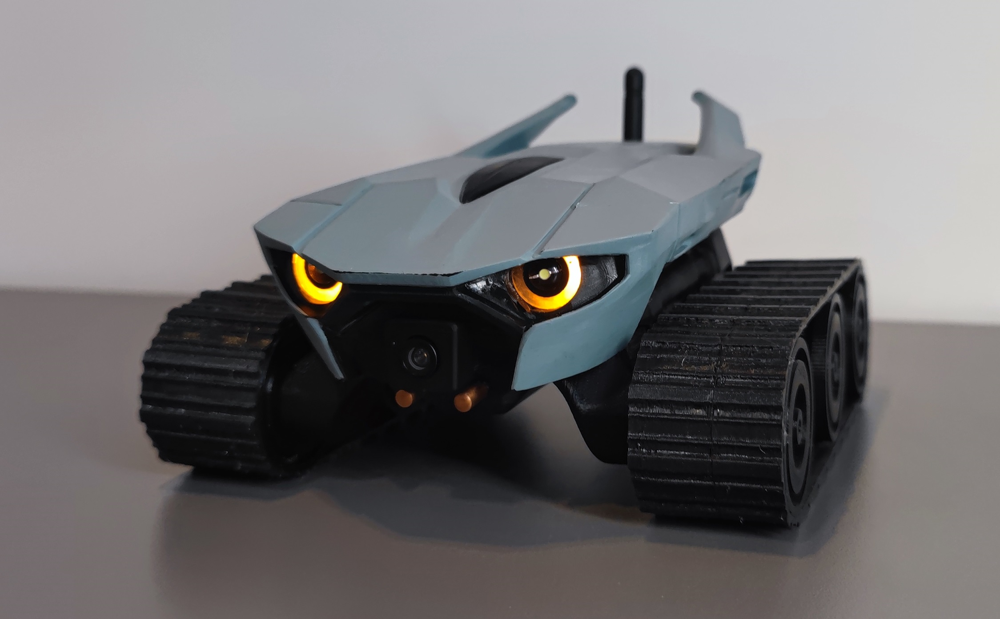

# Caretaker

Caretaker - удаленно управляемый робот на базе esp32-cam икастомной 3д-печатной платформы.

Основные особенности:

* управление по WiFi и BT;
* интеграция с home assistant;
* управление мощными LED в глазах;
* 2 варианта управления - джойстик и слайдер;
* адаптивный веб-интерфейс для управления.

## Ссылки

Весь процесс изготовления детально описывается в серии постов в блоге - https://positroid.tech/post/caretaker-part-1.

Модели для печати - [models/](models) или проект на [thingiverse](https://www.thingiverse.com/thing:7004446).

Схема и чертежи платы - [board/](board).

Прошивка для esp32cam с web-интерфейсом - [esp32-caretaker](https://github.com/positron48/esp32-caretaker).

Интеграция с Home Assistant - [hass-caretaker](https://github.com/positron48/hass-caretaker).

Утилита для конвертации svg в stl для засветки фоторезиста на фотополимерном принтере - [svg2stl](https://github.com/positron48/svg2stl).

Другие варианты ИИ-дизайна, которые не прошли отбор - [ai-renders/](ai-renders).

## Компоненты

### Робот

* Esp32cam - основной мозг - можно ещё найти под названием AI thinker.
* Широкоугольная камера с удлиненным шлейфом - угол обзора не так критичен, как длина шлейфа. В варианте с коротким шлейфом было бы сложнее придумать эстетически приятный корпус.
* Wifi антенна с коннектором - часто идёт в комплекте с платой.
* 3 li-ion батареи, соединенные последовательно (12.6v) с держателями.
* 2 dc-dc понижающих преобразователя (на 12v и на 5v).
* Драйвер двигателя 2-канальный - L298N, L293D или аналог - у меня L293D из-за меньших габаритов платы, хотя моделировал под L298N.
* 2 моторчика GA12-N20 с передаточным числом 150 (можно брать 200 - будет резвее).
* 12 подшипников 6803 (по два на колесо).
* BMS плата зарядки (если планируете заряжать в устройстве). 
* Переключатель для подачи питания с батареи.
* Mosfet IRLML0030 + 1 кОм резистор для управления светодиодами.
* Светодиоды и резисторы - по вкусу.

Все остальные детали - из пластика, распечатаны на принтере (включая гусеницы).

### Зарядная станция:

* Блок питания 12.6V 2A.
* Соответствующий разъём питания для корпуса.
* Вольтамперметр (желательно менее мощный до 5А, иначе небольшой ток не будет показывать).
* Контактная пара - у меня это медные пластины и стержни.
* Пара пружин для лучшего контакта при зарядке.

## Детали создания

В максимальных подробностях все описано в [моем блоге](https://positroid.tech/post/caretaker-part-1). Если перечислить кратко (да, я люблю списки):

* дизайн нарисован ИИ (chatgpt prompting + local forge + flux txt2image);
* спроектированы колеса с внутренним расположением двигателей на 2 подшипниках - fdm печать;
* спроектированы траки (гусеницы) - fdm печать TPU;
* модель сгенерирована ИИ tripo3d (img2stl + ручная ретопология в blender);
* написана прошивка под esp32cam с ИИ (Cursor + Claude Sonnet 3.5, 3.7, OpenAI o3-mini);
* написана кастомная интеграция для Home Assistant с ИИ (те же лица);
* разработата своя плата расширения для esp32 с коннекторами и мосфетом для управления спетодиодами, изготовлена фоторезистом с засветкой на SLA принтере (в процессе с ИИ написан конвертор svg2stl).

## Фото

## Видео

https://www.youtube.com/watch?v=m7IXScezX9o
