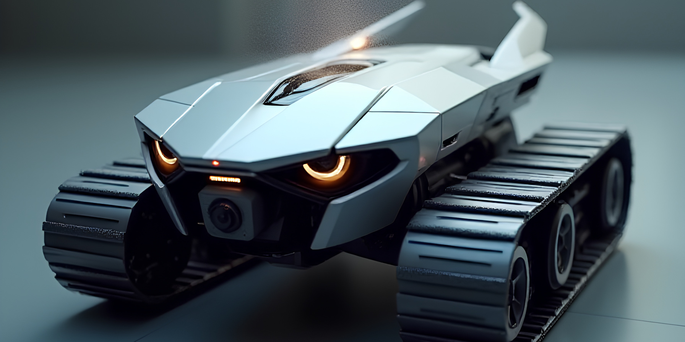
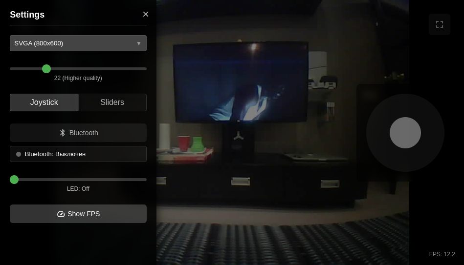
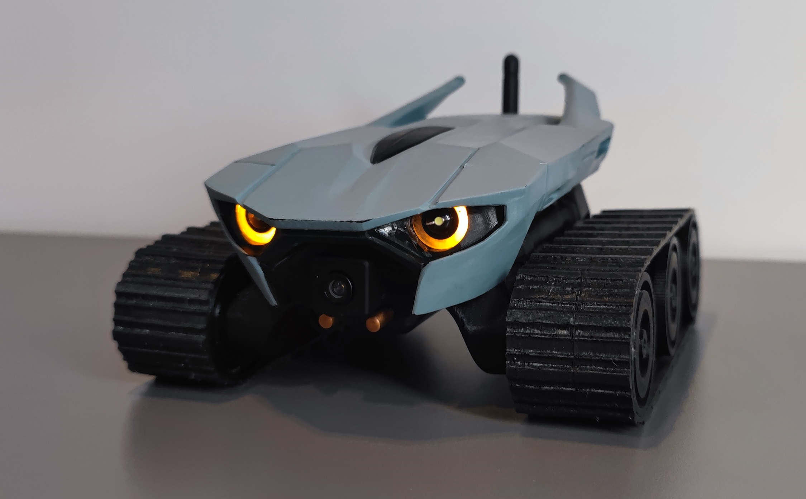
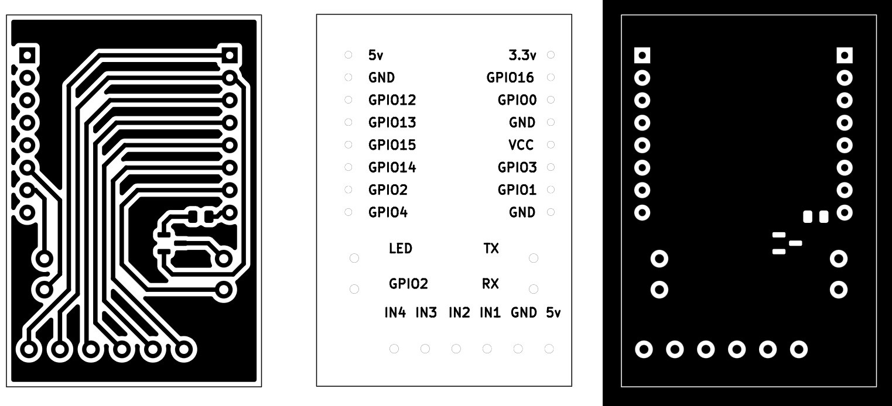
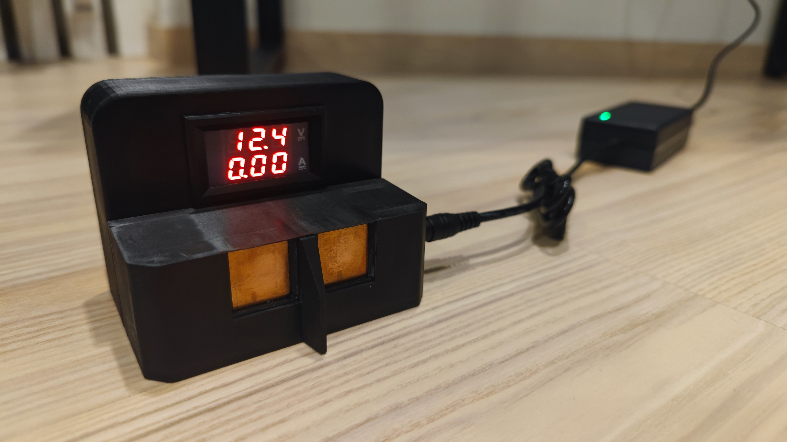

# Caretaker

Caretaker is a remotely controlled robot based on esp32-cam and a custom 3D-printed platform.

Main features:

* WiFi and BT control;
* Home Assistant integration;
* Powerful LED eyes control;
* 2 control options - joystick and slider;
* Adaptive web interface for control.

## Links

The entire manufacturing process is described in detail in a series of blog posts - https://positroid.tech/en/post/caretaker-part-1.

3D printing models - [models/](models) or project on [thingiverse](https://www.thingiverse.com/thing:7004446).

PCB schematics and drawings - [board/](board).

Firmware for esp32cam with web interface - [esp32-caretaker](https://github.com/positron48/esp32-caretaker).

Home Assistant integration - [hass-caretaker](https://github.com/positron48/hass-caretaker).

Utility for converting svg to stl for photoresist exposure on a photopolymer printer - [svg2stl](https://github.com/positron48/svg2stl).

Other AI design variants that didn't make the cut - [ai-renders/](ai-renders).

## Components

### Robot

* Esp32cam - the main brain - can also be found under the name AI thinker.
* Wide-angle camera with extended cable - the viewing angle is not as critical as the cable length. With a shorter cable, it would be more difficult to design an aesthetically pleasing case.
* Wifi antenna with connector - often comes with the board.
* 3 li-ion batteries, connected in series (12.6v) with holders.
* 2 dc-dc step-down converters (12v and 5v).
* 2-channel motor driver - L298N, L293D or similar - I use L293D due to smaller board dimensions, although I modeled for L298N.
* 2 GA12-N20 motors with a gear ratio of 150 (you can take 200 - it will be faster).
* 12 bearings 6803 (two per wheel).
* BMS charging board (if you plan to charge in the device).
* Power switch for battery supply.
* Mosfet IRLML0030 + 1 kΩ resistor for LED control.
* LEDs and resistors - to taste.

All other parts are made of plastic, printed on a printer (including tracks).

### Charging station:

* Power supply 12.6V 2A.
* Corresponding power connector for the case.
* Volt-ampere meter (preferably less powerful up to 5A, otherwise it will not show small current).
* Contact pair - in my case, copper plates and rods.
* A pair of springs for better contact during charging.

## Creation details

Everything is described in maximum detail in [my blog](https://positroid.tech/post/caretaker-part-1). To summarize briefly (yes, I love lists):

* design drawn by AI (chatgpt prompting + local forge + flux txt2image);
* wheels designed with internal motor placement on 2 bearings - fdm printing;
* tracks designed - fdm printing with TPU;
* model generated by AI tripo3d (img2stl + manual retopology in blender);
* firmware written for esp32cam with AI (Cursor + Claude Sonnet 3.5, 3.7, OpenAI o3-mini);
* custom integration for Home Assistant written with AI (same tools);
* developed custom expansion board for esp32 with connectors and mosfet for LED control, manufactured with photoresist exposed on an SLA printer (during the process, an svg2stl converter was written with AI).

## Photos

## Video

TODO 
